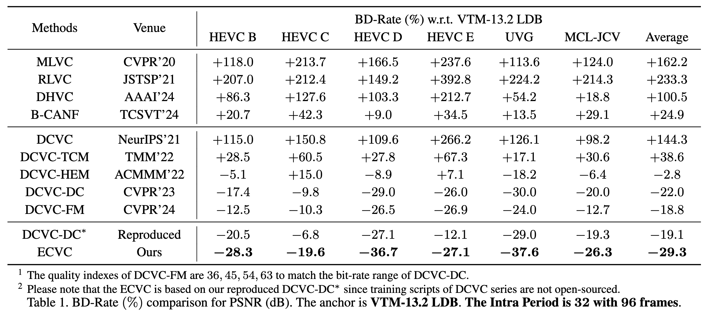
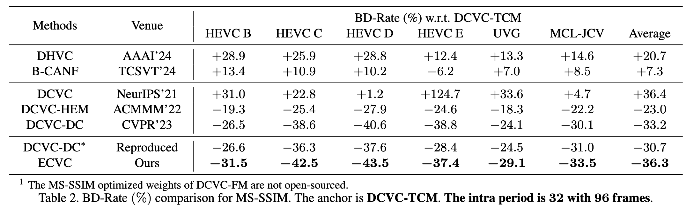
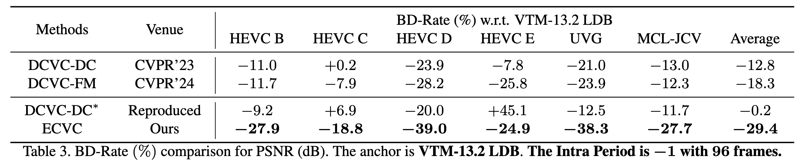
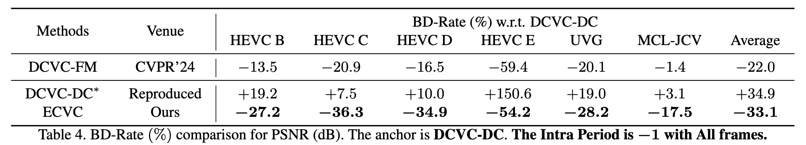

<div align="center">
<h1>ECVC (CVPR 2025)</h1>
<h3>ECVC: Exploiting Non-Local Correlations in Multiple Frames for Contextual Video Compression</h3>
[[Arxiv](https://arxiv.org/abs/2410.09706)]
</div>

### Performance





## Contact

If you have any questions about ECVC, please contact Wei Jiang ( wei.jiang1999@outlook.com or jiangwei@stu.pku.edu.cn )

### Cite

```
@article{jiang2024ecvc,
  title={ECVC: Exploiting Non-Local Correlations in Multiple Frames for Contextual Video Compression},
  author={Jiang, Wei and Li, Junru and Zhang, Kai and Zhang, Li},
  journal={arXiv preprint arXiv:2410.09706},
  year={2024}
}
```
